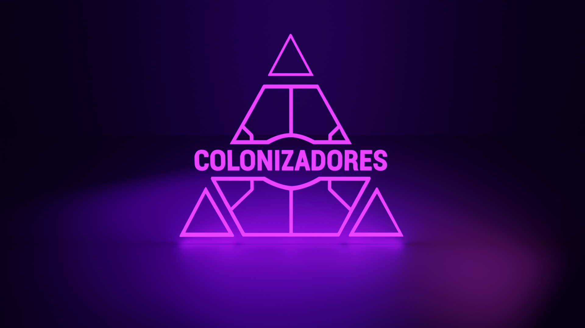
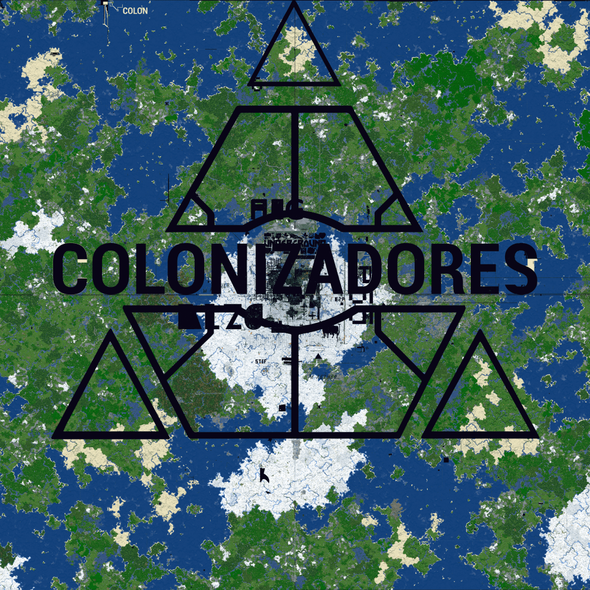
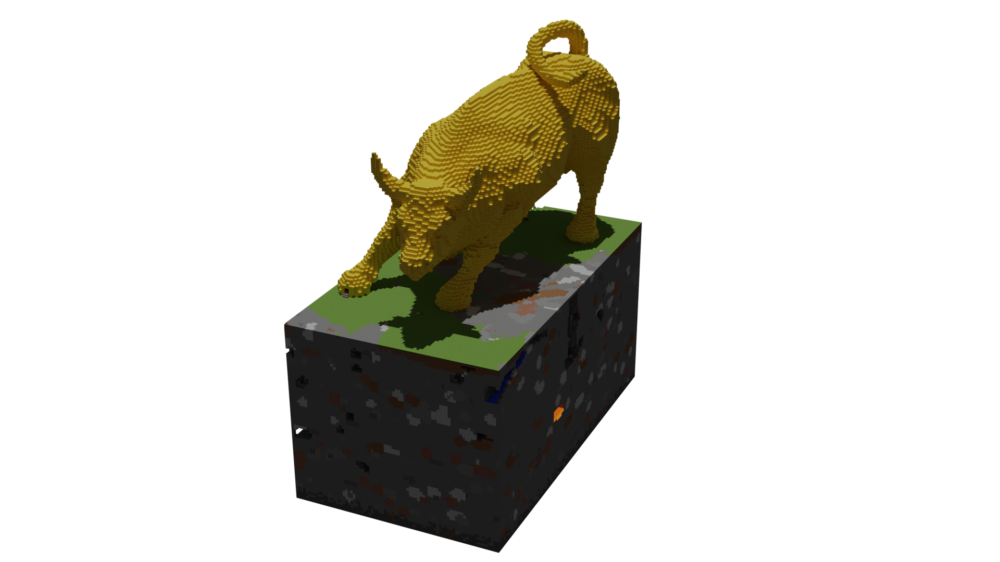
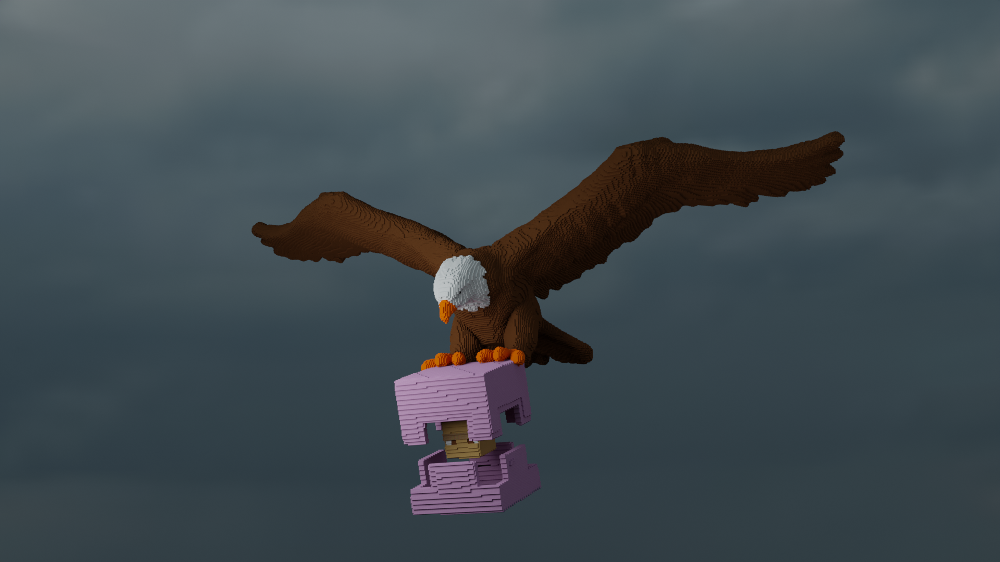
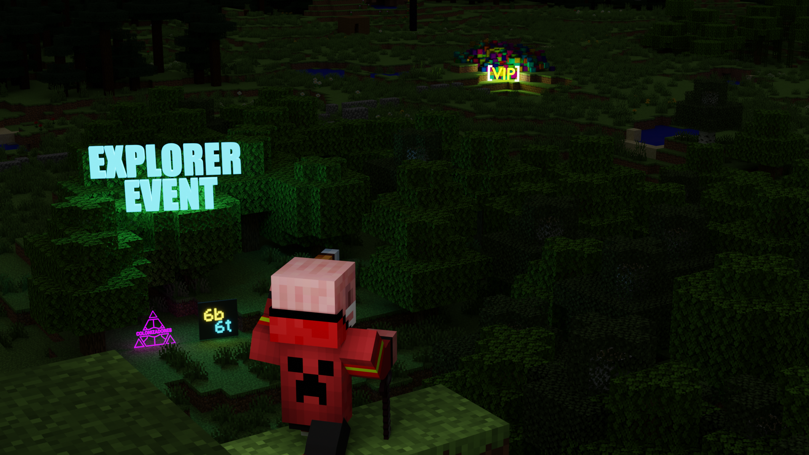
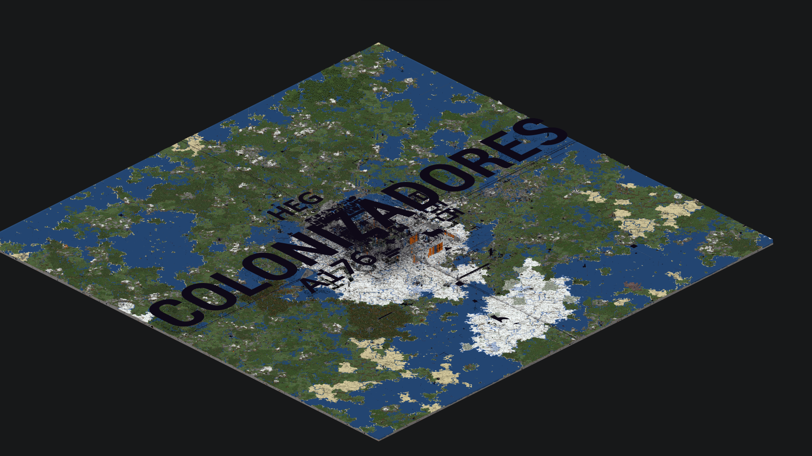
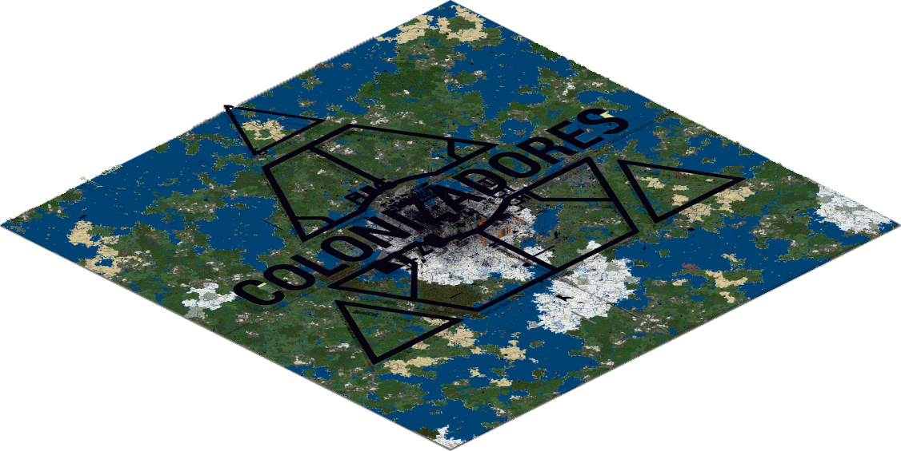
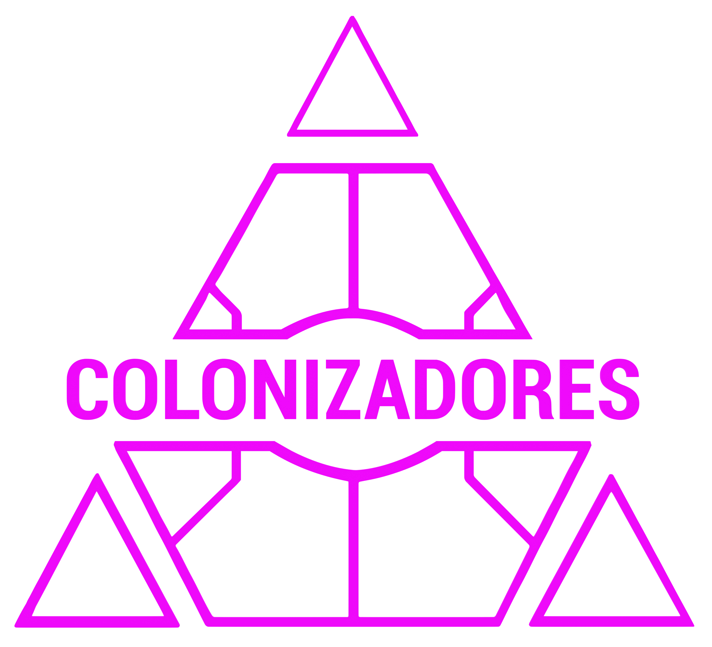

## Identity
* Name: `Colonizadores`
* Abbreviation: `COLON`
* [Discord 🔗](https://discord.colonizador.es/) 
* [Web 🔗](https://colonizador.es/)

## History
* Founding date: 2020 (original 2b2t shop), 2022 (as a clan in 6b6t)
* Founded by: 
  * El_Krisss
  * CarloxCoC
  * 7CJ
* Story:

Colonizadores started as a shop for the 2b2t server in 2020. Its members were El_Kriss, CarloxCoC, andreiclg01, shledaw, 7CJ, and Rupa04. Within a few weeks, the shop gained over 500 members and made dozens of sales, earning more than 200 dollars per week.

A few months later, due to an internal conflict among the sellers, their most important stash was raided, resulting in the loss of more than 40,000 kits. This caused the group to stop playing, but they continued as friends playing other games.

In 2022, 7CJ, CarloxCoC, and El_Kriss decided to return to playing anarchy servers and joined 8b8t to start projects and create a new clan with the same name as the shop: "Colonizadores." Seeing that the player count was low on that server, they decided to move to 6b6t, which became their main server to date.

On 07/31/2022, they published a statement asking users if they would be interested in creating a fully automated delivery bot, and that’s when they began talking about the clan. Carlox programmed a delivery bot on 08/02/2022, very simple but never seen before on these servers.

Almost a month later, on 08/23/2022, the first illegal items event was held on 6b6t. Days before this event, they thought of creating a bedrock logo (built by bots), believing it would remain forever in the sky of 6b6t. This logo became the first bedrock logo in the server’s history and was one of the most talked-about topics in the community. A few days later, a statement was issued saying that bedrock breaks when touched. Groups started forming to destroy the logo, even though it was no larger than 250,000 blocks (it was destroyed within a few days).

After seeing the logo destroyed, they decided to create one made of millions of blocks so that all of 6b6t would remember them. On 08/30/2022 (seven days after the bedrock logo), they announced a logo: an Osborne bull, a very iconic symbol of Spain. This was one of the tests done before creating their name at spawn, and it was a small logo that caused laughter in the communities. Thirteen minutes later, they announced their real logo, for which more than 5.5 million obsidian blocks were used (the largest project on 6b6t to date). They also created 3D and 2D renders of the map (the largest at the time).

Two months after starting on 6b (on 09/12/2022), they reached 2,500 members on Discord, becoming the clan with the most members in the community thanks to their projects and their delivery bot—the only one on the server at that time—that had already distributed more than 6,300 kits.

On 09/23/2022, they created the first website with a 2D map of spawn on the server, being the first to do so. A few weeks later, wanting to outdo themselves, they began announcing a new project they had been working on for weeks: the biggest project on 6b until then.

On 10/08/2022, they started announcing on their Discord that they would present a new project, and on 10/10/2022 they revealed their new logo. Adding the first of 5.5 million obsidian blocks and this second one of 7.7 million, more than 13 million blocks were used, making history again on 6b6t with one of the largest logos of all anarchy servers. More than 12 groups in the community were created to try to grief it. Colonizadores (El_Kriss, CarloxCoC, and 7CJ) decided to defend the logo for weeks. The groups eventually dissolved because they couldn’t overcome the three defenders.

On 10/24/2022, a new project was announced: a statistics website about 6b6t, which did not continue development due to lack of time. Weeks later, another project was created: a new website with a 3D render of the 10k x 10k map, the first 3D render of that size. The project was done three times: one render of 10k x 10k, another of 12k x 12k, and another of 20k x 20k.

At that point, the group decided to set 6b6t aside due to lack of competition and motivation.

On 03/09/2023, they decided to return as 6b6t updated from version 1.12.2 to more recent versions, being one of the first anarchy servers to do so. Colonizadores returned showing some of their bases, and four days later discovered a dupe they automated and turned into their first public addon on 6b6t, being the only functional dupe on the server. Later, this dupe was patched and the item frame dupe was enabled. Colonizadores created a new addon that automated this dupe as well.

On 03/28/2023, all dupes were patched, and a few days later, 7CJ discovered a strange way to dupe using the item frame dupe, although it was patched after a few days.

On 03/31/2023, the delivery bot was updated to version v4 and began working with a point system. Points were earned by spamming in the 6b6t chat. On 04/03/2023, Colonizadores’ Discord reached 5,000 members and over 14,000 shulkers delivered. A week later, it reached 6,000 members—more than 1,000 in less than a week—and surpassed 8,000 members in under a month (for context, the official 6b6t Discord had 10,000 members at that time).

On 07/21/2023, their new project was published: a website with a map that updates in real-time with any user who used their addon, without revealing coordinates outside spawn. This project made Colonizadores the first clan to officially collaborate with 6b6t, creating a community event to see which user downloaded the most map data.

Their last projects were: a 6b chat website, an automated donkey dupe, and a Mapart Gallery, which pushed Colonizadores’ Discord to 10,000 members—the goal they had from the beginning.

This led Colonizadores to leave 6b6t due to lack of motivation and competition (being the only clan creating real projects).

## Accomplishments
- Created the first bedrock logo on 6b6t
- Built the largest obsidian logos on the server (5.5M and 7.7M blocks)
- Developed the first automated delivery bot for 6b6t
- [6b6t real-time map 🔗](https://map.carlox.es/)
- Reached over 10,000 Discord members
- First official clan to collaborate with 6b6t staff
- [3D Render map 🔗](https://6b6t.vercel.app/)
- 2D render map
- 6b6t Stat web (closed)
- Toro dupe addOn
- Colonziadores SpamBot
- [Mario Bros LvL 1-1 map 🔗](https://www.youtube.com/watch?v=sxPUp7Ye3tI)
- Delivey more than 54,000 kits
- [MapArt galery 🔗](https://maparts.carlox.es/)
- Live 6b6t Chat web (closed)
- Automated mapart builder Bot

## Bases
- Eagle shulker Base
- Wall Street Bull Base
- Valle de los caidos Base
- Bases with a couple of million kits (x4)

## Notable Members
- El_Kriss (founder)
- CarloxCoC (founder)
- 7CJ (founder)
- andreiclg01
- Rupa04
- shledaw

## Photos:
  

