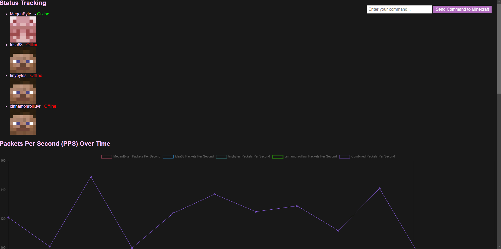
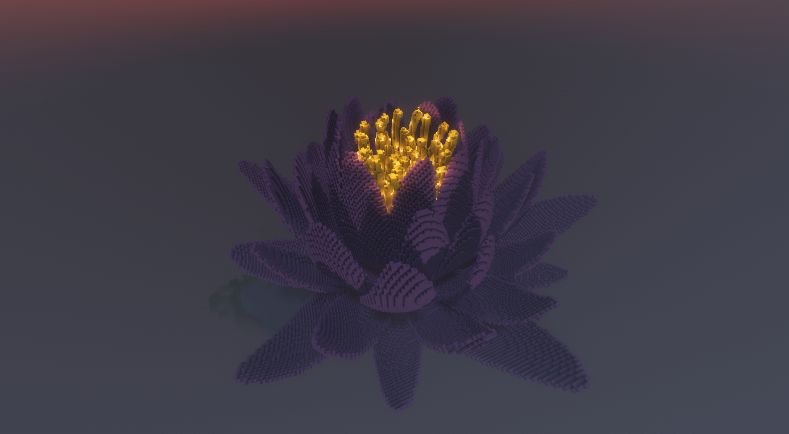
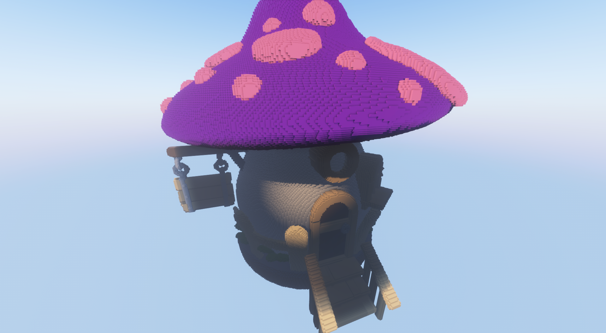
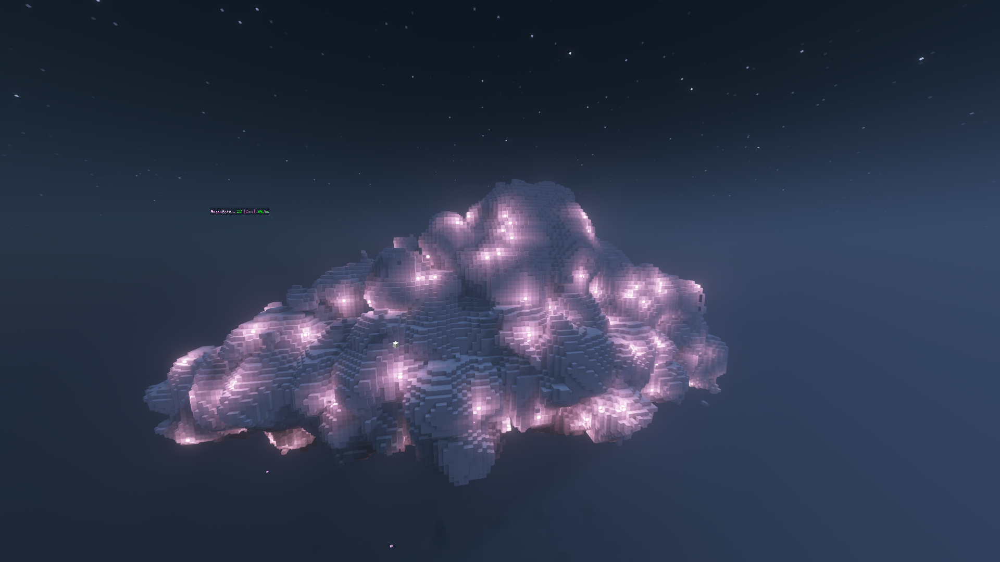

## Identity
* Username: `MeganByte`
* Mainly goes by: Megan

## Contacts
* Discord: `daswe2_38298`
* [Youtube](https://www.youtube.com/@MeganByte-kc4vk)
* [GitHub](https://github.com/MeganByte72)

## Joindate
* December 1st, 2024

## Minecraft Account list
* MeganByte_
* (Has many accounts she utilizes for bots but the names are often changed.)

## Accomplishments
* Griefed `PolarV2`'s personal stashes many times.
* Started Back Street Boys (clan) before handing it over to `bot_mob`.
* Built many things for projects and build competitions for Saviors and trilogy.
* Created the schematics for the original obsidian spawn logo for Saviors and helped build many other obsidian spawn logos.
* Her build at the Saviors recruit base inspired the creation of a Japanese-themed base
* **Coding projects**
  * Bot control systems
  * Client for beta minecraft

## Groups
* Saviors
* Watchmen
* Imperials
* Trilogy
* The Highway Men
* Blackout

## Groups Founded 
* Midnight Club (Disbanded) 
* Back Street Boys (Disbanded)
* Sakura (Disbanded)

## Images (Bot Control System)

## Build Pictures

## Skin
